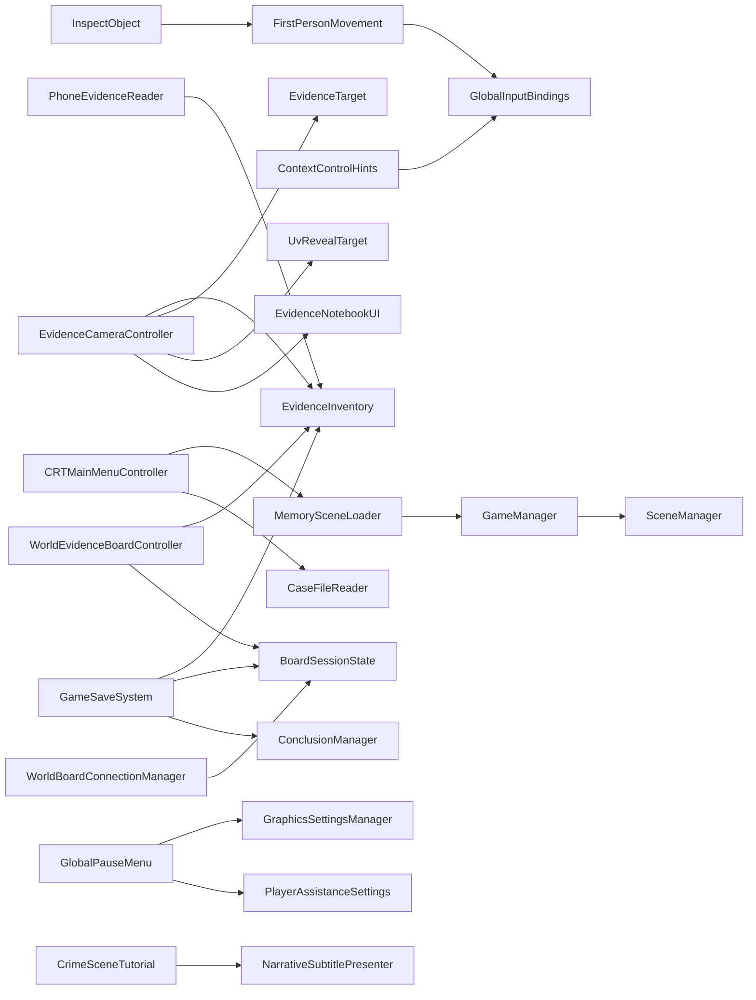

# Archive: NULL - Arquitectura de codigo

Este mapa resume las dependencias principales. El `GameManager` controla el ciclo de vida general y los cambios de escena; no concentra reglas que pertenecen a evidencia, narrativa, guardado o interfaz.

## Responsabilidades

- `GameManager`: ciclo de vida global, escena activa y proteccion contra cargas simultaneas.
- `GameSaveSystem`: persistencia y restauracion de progreso.
- `EvidenceInventory`: fuente de verdad de evidencias registradas.
- `EvidenceCameraController`: herramientas equipables, fotografia y revelado UV.
- `PhoneEvidenceReader`: navegacion interna del telefono y hallazgos digitales.
- `WorldEvidenceBoardController`: representacion fisica de evidencias en la oficina.
- `CRTMainMenuController`: interfaz diegetica del monitor y acceso a memorias.
- `GlobalPauseMenu`: pausa y configuracion compartida.
- `CrimeSceneTutorial` y `OfficeSpeakerTutorial`: progresion de ayudas por contexto.

## Regla para extender

Una funcion nueva debe vivir en el sistema que posea sus datos. El `GameManager` puede iniciar o coordinar el flujo, pero no debe almacenar evidencias, textos narrativos ni configuracion visual. La comunicacion entre sistemas debe preferir eventos o interfaces publicas pequenas antes que busquedas globales repetidas.
